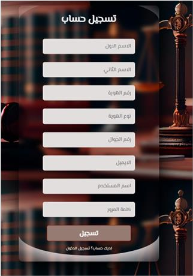
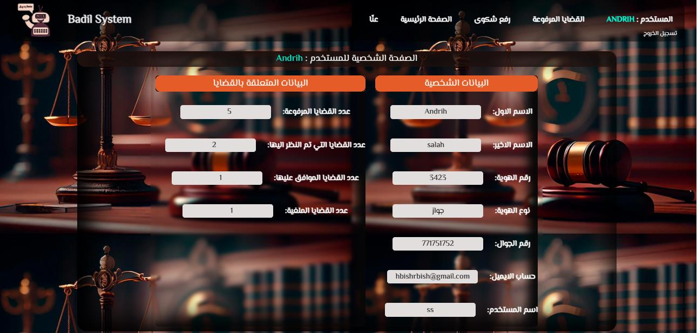
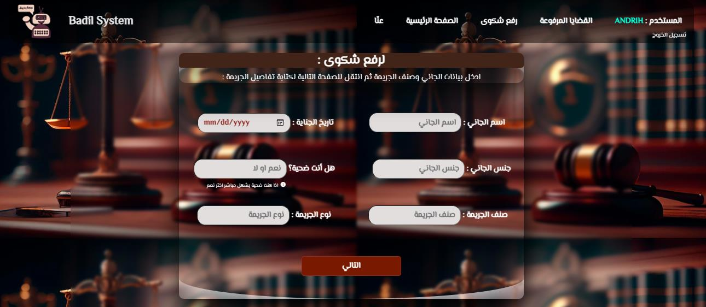
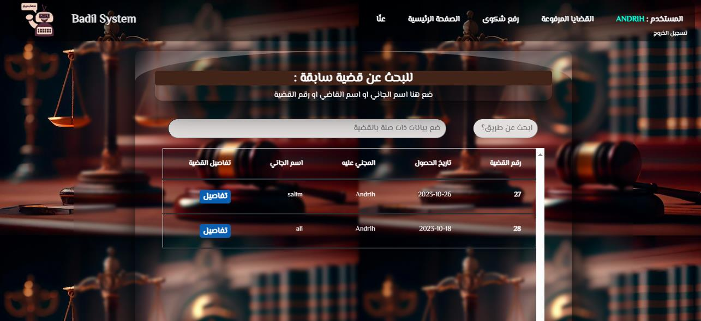
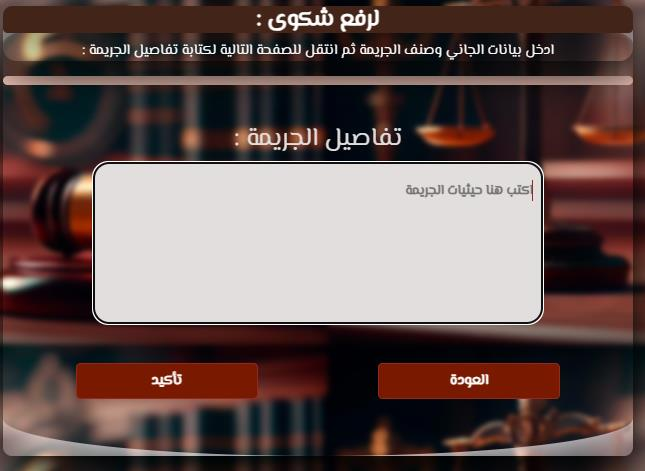
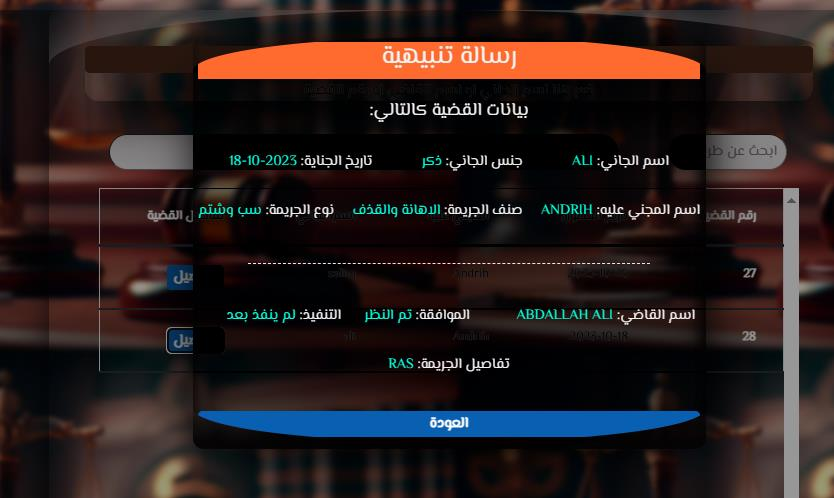
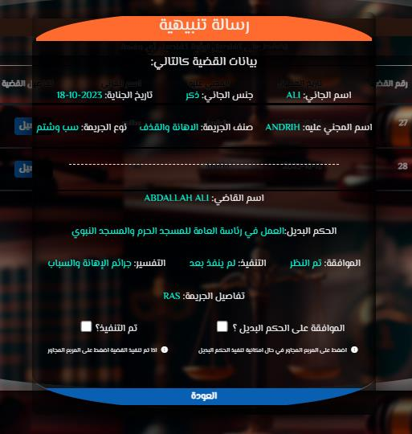
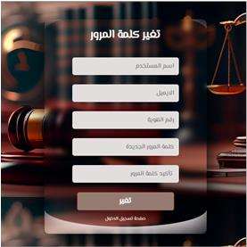

# Badil System

Badil System is an intelligent web-based platform designed to enhance criminal justice procedures by leveraging Natural Language Processing (NLP) for automated, transparent, and fair handling of crime-related complaints and the recommendation of correctional alternatives. The system enables citizens to submit complaints, automates crime type classification, and recommends suitable non-custodial measures—streamlining case processing for judicial and executive authorities.

---

## Features

* **Centralized Complaint Portal:** Citizens can submit detailed narratives about crimes or violations.
* **Automated Crime Classification:** NLP algorithms analyze complaint text to classify crime types.
* **Correctional Alternative Recommendations:** Suggests rehabilitation-focused alternatives to imprisonment, tailored to the offense.
* **Role-Based Access & Workflow:**

  * **Citizens:** Register, submit complaints, track their cases.
  * **Judges:** Review cases, approve or reject recommended alternatives, set ruling durations.
  * **Executive Authorities:** Enforce approved alternatives, update status, manage implementation.
* **Case Tracking & Analytics:** Real-time dashboard and statistics for all user roles.
* **User Authentication & Security:** Robust login and access control for all users.
* **Modern, Responsive Interface:** Built with HTML5, CSS3, Bootstrap, and AJAX for an interactive user experience.

---

## System Architecture Overview

The Badil System consists of three core layers:

* **Frontend:** Built using HTML5, CSS3, JavaScript, Bootstrap, and AJAX for responsive, real-time interfaces.
* **Backend:** Powered by PHP, interfacing with a MySQL database for user management, workflow logic, and data storage.
* **NLP Engine:** Implemented in Python, the NLP engine processes textual complaint data to classify crimes and recommend alternatives. It integrates with the backend via direct script calls or RESTful API.

**Workflow Summary:**

1. Citizen submits complaint through the web portal.
2. NLP engine analyzes complaint, classifies crime, and recommends correctional alternatives.
3. Judge reviews the case and system recommendations, then approves/rejects the alternatives.
4. Executive authority implements or logs the approved alternative, updating case status.

---

## Installation & Setup

### Prerequisites

* **Windows 10** (recommended; also works with Linux/macOS with LAMP stack)
* **XAMPP** (includes Apache, PHP, MySQL)
* **Python 3.8+** (for NLP module)
* **pip** (Python package manager)
* **Node.js/NPM** (optional, for frontend asset management)

### 1. Clone the Repository

```bash
git clone https://github.com/sa1ah-ai/badil_system.git
cd badil_system
```

### 2. Backend Setup

* Install and run **XAMPP**.
* Use **phpMyAdmin** to create a MySQL database (e.g., `badil_db`).
* Import the provided SQL schema (`/db/schema.sql` or equivalent).
* Update database connection settings in `/backend/config.php`.
* Start Apache and MySQL services in XAMPP.

### 3. NLP Engine Setup

* Navigate to the Python/NLP directory (e.g., `/ml` or `/python`).
* Install Python dependencies:

  ```bash
  pip install -r requirements.txt
  ```
* Run the training script or load the pre-trained model as described in `/ml/README.md`.
* If the NLP service is provided via REST API, launch it and ensure the backend can reach the API.

### 4. Frontend Setup

* Serve the frontend files via Apache (`/frontend` or `/public` directory).
* Ensure AJAX requests correctly target backend PHP endpoints.

---

## Usage

### For Citizens

* Register an account and log in.
* Submit a complaint by providing details about the crime/violation.
* Track the status of complaints and view recommended correctional alternatives.

### For Judges

* Log in through the judge portal.
* Access and review new cases and system recommendations.
* Approve or reject alternatives, set durations, and monitor statistics.

### For Executive Authorities

* Log in through the executive portal.
* View approved cases, implement correctional measures, and update case statuses.

---

## Technology Stack

* **Frontend:** HTML5, CSS3, JavaScript, Bootstrap, AJAX
* **Backend:** PHP 7+, MySQL
* **Machine Learning/NLP:** Python (scikit-learn, pandas, numpy, etc.)
* **Environment:** XAMPP (for local development), compatible with any LAMP stack

---

## Screenshots

Below are sample screenshots showcasing key interfaces of the Badil System. All images are stored in the `sys_screenshots` folder. Thumbnails are displayed here for quick reference:

<p float="left">
  
  
  
  
  
</p>

<p float="left">
  
  
  
  
</p>

### Image Descriptions

| Screenshot                     | File Name                       | Description                                           |
| ------------------------------ | ------------------------------- | ----------------------------------------------------- |
| **Login**                      | login.png                       | User authentication page                              |
| **Create Account**             | create\_account.png             | Registration form for new users                       |
| **Profile**                    | profile.png                     | User profile with personal/case statistics            |
| **Case Filing Questionnaire**  | case\_filing\_questionnaire.png | Initial complaint/case submission form                |
| **Upload Case Page**           | upload\_case\_page.png          | Interface for filing/uploading a new case             |
| **Text of Crime Details**      | text\_of\_crime\_detalis.png    | Input for narrative details of the crime              |
| **Case Details**               | case\_details.png               | Case data and decision workflow                       |
| **Crime Details (Judge View)** | crime\_details\_Judge.png       | In-depth view for judges, including decision/approval |
| **Change Password**            | change\_password.png            | User password reset form                              |

For the complete user experience, see all files in the `sys_screenshots` folder. Images can be expanded for detail when viewed in your code hosting platform.

---

## Extensibility & Customization

* **NLP Model:** Upgrade to advanced deep learning models or retrain with new datasets.
* **Workflow:** Add new user roles or process steps to fit evolving judicial or administrative needs.
* **Analytics:** Expand dashboards and reporting features for deeper insights.
* **Localization:** Adapt the interface and NLP processing for additional languages or jurisdictions.

---

## Limitations

* Optimized for Windows environments via XAMPP; for Linux/macOS, a standard LAMP setup is required.
* NLP accuracy is dependent on training data quality; for best results, use domain-specific datasets.
* Integration between backend and NLP engine may require configuration based on deployment context.

---

## License

This project is provided for research and non-commercial use. For commercial or large-scale deployment, please contact the project maintainer.
